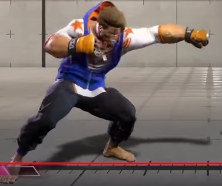
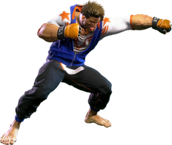

# Computer Vision Final Project: Street Fighter Feature Matching

## Goal of Project
Applying the concepts of image transformation and feature matching that we learned in CS 482 and applying to using it so a program takes an input of a Street Fighter character image, and is able to correctly identify which character it is, and what move it is.

|  |
|:--:|
| *The Test Image* |

|  |
|:--:|
| *The Image we want to match it to* |

## Approach Taken: Data Assembly
For each of the 21 Street Fighter 6 characters, png files for all of its fighting moves were organized into a folder (one for each character). We created a directory that holds json files for each character. Each json file contains a name, and a list of moves. For each move there is information on the move name, its corresponding image file name, and stats on the move (on hit, on block).

## Test Images
Test images were gathered from multiple sources: screenshots from in game and screenshots from YouTube videos.

## Approach Taken: SIFT
Our main technique throughout the project was using SIFT to detect features and match them between pictures that could be different of different size and shape, so the scale invariant part of SIFT proved to be very useful for our purposes. For implementation, we used openCV’s library for a fast and effective way of feature detection and matching. Iterate through all character images, choose image with most “good” matches.

How to run it:

```bash
python3 sift.py test_files/[insert image file to test]
